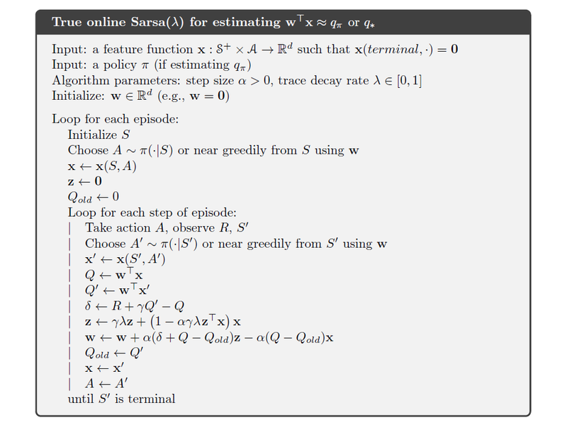

# Main algorithm for pokemon showdown master
Pokemon showdown master's Artificial Intelligence (AI) is implemented using **True online State–action–reward–state–action (Sarsa)** algorithm, which is also known as the Temporal-Difference (TD) method for action values. The diagram below shows the pseudocode for this algorithm:

## Feature function
Feature function is the most important component of the True online Sarsa algorithm. Regarding the detailed implementation of the feature function, check out [this document](feature_function.md).

## Policy
TODO

## Algorithm parameters
TODO

## References
[1] Richard S. Sutton and Andrew G. Barto. (2018). Reinforcement Learning: An Introduction. 2nd ed.

[2] Harm van Seijen, A. Rupam Mahmood, Patrick M. Pilarski, Marlos C. Machado and Richard S. Sutton. (2016). True Online Temporal-Difference Learning.
